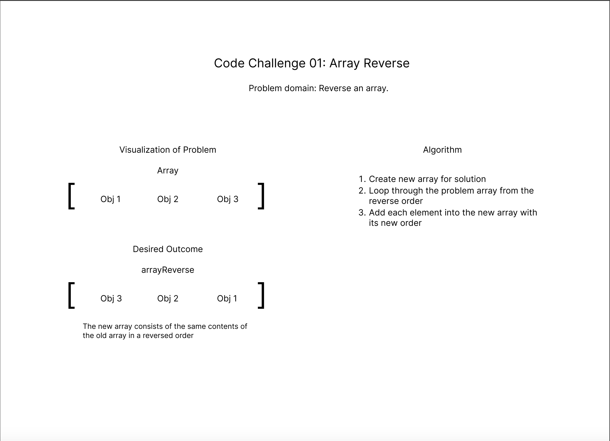

# Challenge Title

Code Challenge 01: Array Reverse

## Whiteboard Process

## Approach & Efficiency

- Create new array for solution
- Loop through the problem array from the reverse order
- Add each element into the new array with its new order

## Solution

function reverseArray (arr) {
  const reversedArray = [];

  for (let i = arr.length - 1; i >= 0; i--) {
    reversedArray.push(arr[i]);
  }
  return reversedArray;
}

## Resources

ChatGPT
